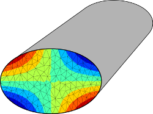

# stVenantTorsion
   
__BEM/ FEM to compute the torsional-stiffness of a beam-section__
## Build
### Dependencies

- Eigen
- laplaceKernels
- pybind11

### Compile
```bash
cd path_to_stVenant
mkdir build
cd build
cmake ..
make
sudo make install
```

## Use

### BEM:
- geometry as boundaries:
  - multiple boundaries are used for mult-bounded-sections
  - the outermost boundary has a positive (rigth hand) direction (b1)
  - a hole is defined by oposite direction (b1)

```python
import stVenant
b2 = [[-2, -2], [2, -2], [2, 2], [-2, 2]]
b1 = [[-1, -1], [-1, 1], [1, 1], [1, -1]]
bemCase = stVenant.TorsionBemCase([b1, b2])
bemCase.run()
bemCase.get_torsion_moment()
bemCase.get_polar_moment()
bemCase.get_w([x, y])       #->solution (warping)
bemCase.get_stress([x, y])  #->gradient of the solution (stress)
```

### FEM
- geometry as mesh
    - vertices: list of lists with 2 values [[x1, y1], [x2, y2]...]
    - triangles: list of lists with 3 indices [[i1, i2, i3], ...]


```python
import stVenant
femCase = stVenant.TorsionFemCase(vertices, triangles)
femCase.run()
femCase.get_torsion_moment()
femCase.get_polar_moment()
femCase.get_w()       #->solution (warping of every vertex)
femCase.get_stress()  #->gradient of the solution (stress of every triangle)
```
